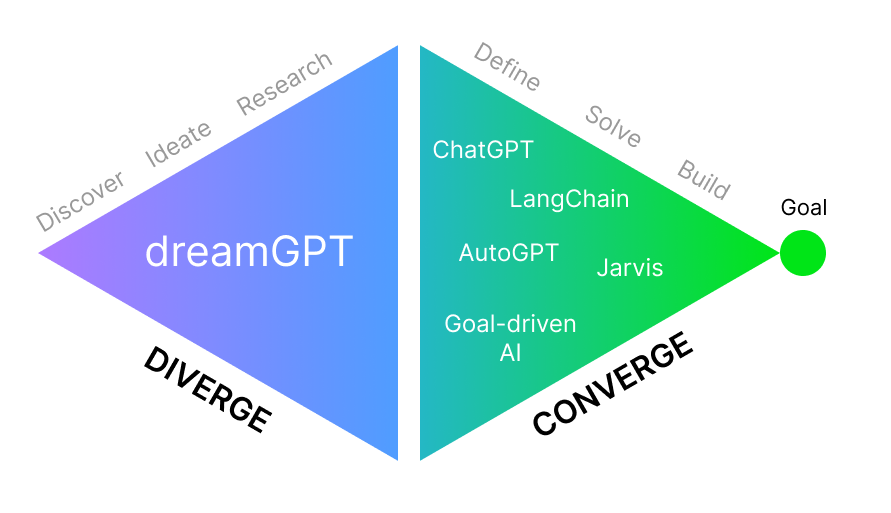
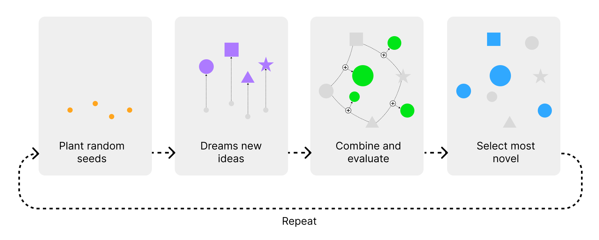
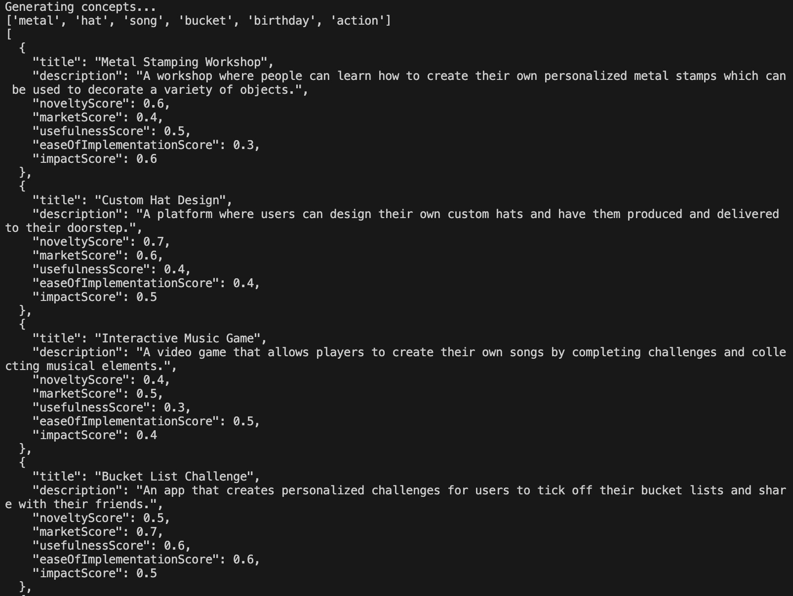

# **dreamGPT**: AI powered inspiration

dreamGPT, the first GPT-based solution that uses hallucinations from LLMs for divergent thinking to generate new innovative ideas. Hallucinations are often seen as a negative thing, but what if they could be used for our advantage? dreamGPT is here to show you how. The goal of dreamGPT is to explore as many possibilities as possible, as opposed to most other GPT-based solutions which are focused on solving specific problems.

 

 

This is how it works:

 

 

To use dreamGPT, you will need to have the following installed:

- Python 3.10+
- [Poetry](https://python-poetry.org/docs/#installation)

## Setup

- Clonse the dreamGPT repository from GitHub:
  - `git clone https://github.com/DivergentAI/dreamGPT.git`
- Rename `.env.example` to `.env` and fill in the values.
  - `OPENAI_API_KEY`: Your OpenAI API key.
  - **Optional**: If you wish to store the "dreams" in Pinecone, fill in the following values:
    - `PINECONE_API_KEY`: Your Pinecone API key.
    - `PINECONE_ENVIRONMENT`: The name of the Pinecone environment.

Then, you can run the dreamGPT script to generate new ideas:

1. Run `poetry install` to install dependencies.
2. Run `poetry run start` to start dreamGPT.
   - If you wish to provide a guiding theme, you can run `poetry run start --theme "your theme here"`.

Once you run it, dreamGPT generates a random seed of concepts and will use these as a starting point for its dreaming process. Here is a screenshot of the first iteration. Notice that the scores are not very high. As dreamGPT evolves the dreams, you will start to see higher scores with even better ideas.

 

 

## dreamGPT star history

